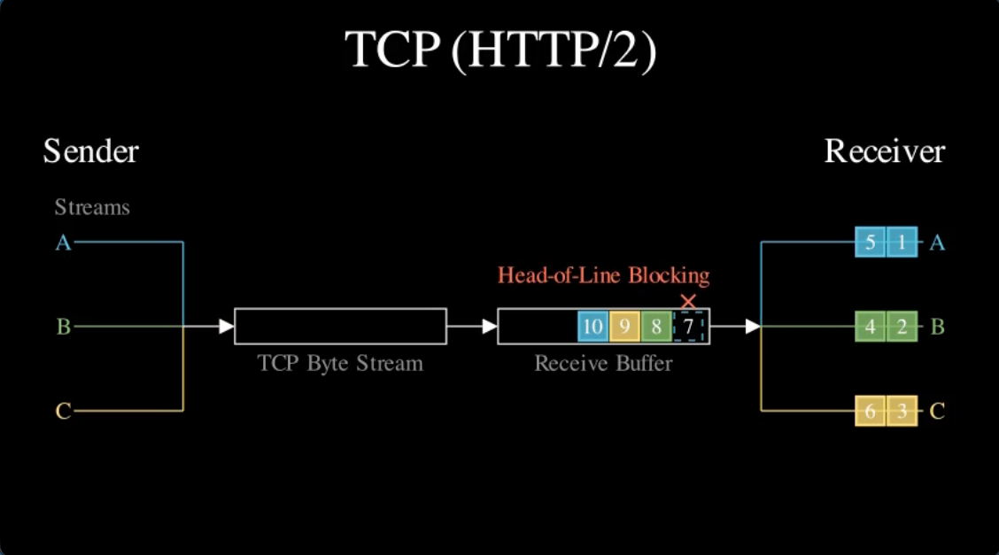
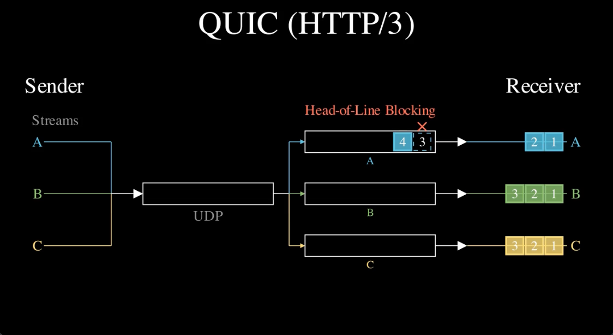
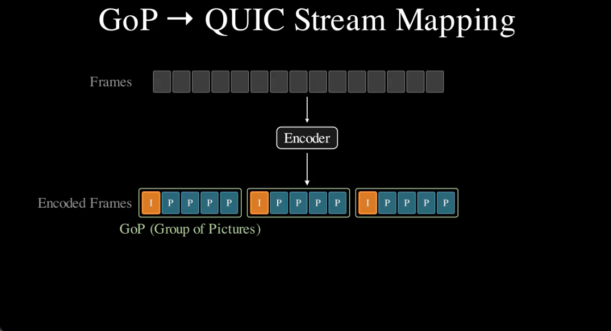
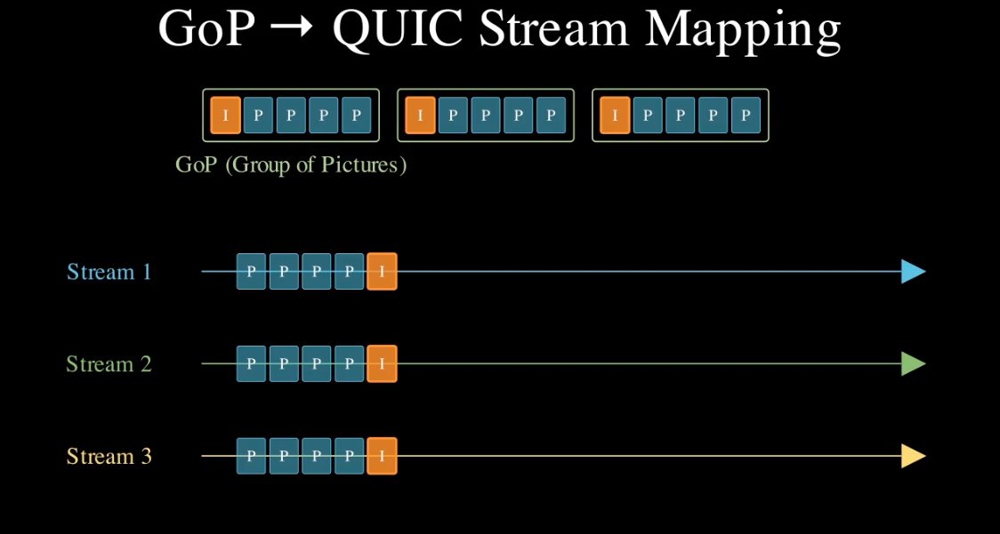

# わかった気になる Media over QUIC

## はじめに

### この資料は何か

ソフトウェアエンジニア向けに MoQ (Media over QUIC) の概要を説明した資料。

MoQ の仕様 (Internet-Draft) は、いきなり読むにはハードルが高い。
この資料は、配信技術に馴染みのないエンジニアでも MoQ の全体像や勘所をつかめるようにまとめたものである。

この資料で扱うテーマは以下の通り。
- MoQ はどのようなプロトコル群か (QUIC / MoQT / MSF)
- MoQ は QUIC をどう上手く使うのか
- MoQT はデータをどう構造化するのか (データモデル)
- Relay によって配信をどうスケールさせるのか
- データはどのような流れで届くのか

以下のテーマは扱わない。
- MoQ はどういう経緯で生まれたのか
- 既存技術 WebRTC, HLS/DASH との比較
- 各仕様 (MSF, LOC, CMSF, QUIC/WebTransport など) の詳細

### 要約

先に結論を知りたい人向けに、この資料のポイントをまとめる。

- MoQ は QUIC (トランスポート), MoQT (データモデル + Pub/Sub), MSF (メディアの記述 + MoQT への乗せ方) で構成されるプロトコル群
- QUIC では Stream が独立しているため、パケットロスの影響を Stream 単位に閉じ込められる
- MoQ はこの性質を活かし、メディアデータを適切な粒度 (GoP 単位) で Stream に分けて送る
- MoQT のデータモデルは Track > Group > Subgroup > Object の階層構造
- Relay の fan-out と多段配置により、配信規模をスケールさせることができる
- データ配信は、セッション確立 → Namespace の発見 → Track の購読 → データ転送の順に進む

## MoQ とは何か

MoQ (Media over QUIC) とは、QUIC を上手く使ってメディア (映像・音声) を配信するためのプロトコル群である。

MoQ のプロトコルスタックは、シンプルに捉えると以下の 3 層で構成されている。

```
┌──────────────────────────────────────────┐
│    MoQT Streaming Format (MSF)           │ メディアの記述方法 + MoQT への乗せ方
├──────────────────────────────────────────┤
│    Media over QUIC Transport (MoQT)      │ データモデル + Pub/Sub
├──────────────────┬───────────────────────┤ ┐
│                  │      WebTransport     │ │
│                  ├───────────────────────┤ │
│                  │        HTTP/3         │ │ トランスポート
│                  └───────────────────────┤ │
│                   QUIC                   │ │
└──────────────────────────────────────────┘ ┘
```

> [!NOTE]
> ブラウザからは WebTransport over HTTP/3 経由で QUIC を使う。

それぞれを順に説明する。

### QUIC

QUIC は、TCP のような信頼性のある通信と、独立したストリームの多重化を提供するトランスポートプロトコルである。

- TCP と同様に、信頼性のある通信 (再送・順序保証・輻輳制御・フロー制御) ができる
- TCP と異なり、1 つの接続の中に複数の独立した Stream を持てる (Stream 多重化)

MoQ は Stream の独立性を活かして設計されている。
この性質は重要であるため、TCP 上の Stream 多重化と QUIC の Stream 多重化の違いを図で説明する。

TCP 上で複数の Stream を多重化する場合 (HTTP/2 がこれにあたる)、TCP は全データを 1 本のバイトストリームとして扱う。そのため、1 つのパケットロスが全 Stream をブロックする (Head-of-Line blocking)。

[](https://github.com/user-attachments/assets/0ba41d9e-e315-46f4-a998-20397183fbdb)

一方、QUIC は UDP ベースのプロトコルで、Stream ごとに独立したバイトストリームを持てる。パケットがロスしても、影響は該当 Stream に閉じる。

[](https://github.com/user-attachments/assets/59afc586-b819-4292-a9af-39d44edc24ec)

MoQ はこの性質を活かし、映像・音声のデータを適切な粒度で Stream に分けて送信する。詳しくは後述する。

### MoQT

MoQT (Media over QUIC Transport) は、QUIC 上で汎用的なデータ配信を行うためのプロトコルである。
主に下記の 2 つを定義している。

1. データをどう構造化するか (Track / Group / Subgroup / Object)
2. 中継サーバーである Relay を介してスケーラブルに配信するための Pub/Sub の仕組み

MoQT は、データの構造化と配信のアーキテクチャを定義しており、MoQ の中核にあたる。
この資料では、MoQT を中心に説明する。

### MSF

MSF (MoQT Streaming Format) は、MoQT 上にどう映像・音声を乗せるかを定めた仕様である。主に下記の 2 つを定義している。

1. どのような映像・音声を配信しているかの記述方法
2. 映像・音声をどう区切って MoQT 上で送るかのルール

この資料では、それぞれ雰囲気だけ伝える。

記述方法について説明する。配信する映像のコーデック・解像度・フレームレートなどの情報を、カタログと呼ばれる JSON に記述する。
配信側はこのカタログを Track (MoQT のデータ構造の一つ) として配信する。
受信側はその Track を購読することで、どのような映像・音声が配信されているかを知ることができる。

次に乗せ方を説明する。MSF では、LOC (Low Overhead Media Container) という仕様に基づき、エンコード済みの映像の 1 フレームを 1 Object (これも MoQT のデータ構造の一つ) にマッピングして送る。

> [!NOTE]
> HLS/DASH などで使われる CMAF でパッケージングされたメディアを Object にマッピングする CMSF という拡張仕様もある。

### MoQ は QUIC をどう上手く使うのか

プロトコルの詳細に入る前に、MoQ がメディアデータをどのように QUIC Stream に乗せるかのイメージを掴んでほしい。
結論から言うと、MoQ は映像データを GoP (Group of Pictures) という単位で分割し、各 GoP を 1 つの QUIC Stream にマッピングする。

映像は通常、フレーム (= 1 枚の画像) の連続として表現される。
フレームをそのまま送るとデータ量が大きいので、映像コーデックを使って圧縮する。
映像コーデックでは一般に、次の種類のフレームがある。

- I-frame (キーフレーム): 他のフレームに依存せず、単体でデコードできるフレーム
- P-frame: 直前のフレームとの差分だけを持つフレーム。単体ではデコードできない

[](https://github.com/user-attachments/assets/e84fe57d-cf83-41a9-9cbd-f3dd9b75e158)

I-frame を先頭に、後続の P-frame をまとめた単位を GoP (Group of Pictures) と呼ぶ。
GoP 内のフレームは先頭の I-frame から順にデコードする必要がある。P-frame は前のフレームとの差分であり、先行するフレームがないとデコードできないためである。
例えば、30fps でキーフレーム間隔が 1 秒の映像なら、1 つの GoP は I-frame 1 枚 + P-frame 29 枚 = 30 フレームになる。

MoQ では、この GoP を 1 つの QUIC Stream に乗せる。



このマッピングにより、QUIC Stream の性質を以下のように利用できる。

- GoP 内のフレームは順序通りに届く必要がある → Stream は順序保証してくれる
- GoP ごとに独立した Stream になる → ある GoP のパケットロスが、別の GoP の配信をブロックしない。例えば、古い GoP で再送待ちが発生しても、新しい GoP はブロックされずに届く

## Media over QUIC Transport (MoQT)

ここからは、MoQT のデータモデルと Pub/Sub の仕組みを詳しく説明する。

### データモデル

MoQT のデータモデルは、映像や音声などのデータを Track > Group > Subgroup > Object の階層構造で表現する。

> [!WARNING]
> MoQT 自体は各階層構造それぞれに何をマッピングするかを規定していない。
> 以降では、わかりやすさのために MSF に沿って映像を例に説明する。

例えば、Alice の映像配信は下記の階層構造になる。

```
// Track > Group > Subgroup > Object の階層構造
Track: "Alice の映像"
├── Group 0 (GoP)
│   └── Subgroup 0
│       ├── Object 0 (I-frame)
│       ├── Object 1 (P-frame)
│       ├── Object 2 (P-frame)
│       └── ...
├── Group 1 (GoP)
│   └── Subgroup 0
│       ├── Object 0 (I-frame)
│       ├── Object 1 (P-frame)
│       ├── Object 2 (P-frame)
│       └── ...
...
```

Track は、メディアの論理的な単位である。
例えば「Alice の映像」や「Alice の音声」がそれぞれ 1 つの Track に対応する。
Subscriber は、この Track 単位でデータを購読する。

Track の中は Group で区切られる。
Group は途中参加ポイント (join point) として機能する。途中から購読した Subscriber は Group の境界から受信を開始できる。
映像の場合、GoP が Group に相当する。

Group の中はさらに Subgroup で区切られる。
1 Subgroup が 1 QUIC Stream にマッピングされる。
先ほどの例では 1 Group = 1 Subgroup なので、GoP がそのまま 1 つの QUIC Stream に対応する。
1 Group に複数の Subgroup を持たせることもでき、その場合は 1 つの GoP が複数の QUIC Stream に分かれる。

Object は MoQT における最小のデータ単位で、MSF では映像の 1 フレームが 1 Object に対応する。

<details>
<summary>より実践的な例: 複数の Subgroup を使う映像 (SVC)</summary>

先ほどの例では 1 Group = 1 Subgroup にしていた。
SVC (Scalable Video Coding) では、1 つの映像を Base Layer (低品質) と Enhancement Layer (高品質) に分けてエンコードする。

この場合、レイヤーごとに Subgroup を分けることができる。
Subgroup が分かれると QUIC Stream も分かれるため、以下のような制御が可能になる。

- Base Layer を優先して配信する
- 帯域不足時に Enhancement Layer だけを破棄し、品質を下げつつ配信を継続する

```
Track: "Alice の映像 (SVC)"
├── Group 0 (GoP)
│   ├── Subgroup 0 (Base Layer)
│   │   ├── Object 0 (I-frame)
│   │   ├── Object 1 (P-frame)
│   │   ├── Object 2 (P-frame)
│   │   └── ...
│   └── Subgroup 1 (Enhancement Layer)
│       ├── Object 0 (enhancement data)
│       ├── Object 1 (enhancement data)
│       ├── Object 2 (enhancement data)
│       └── ...
├── Group 1 (GoP)
│   ├── Subgroup 0 (Base Layer)
│   │   ├── Object 0 (I-frame)
│   │   ├── Object 1 (P-frame)
│   │   ├── Object 2 (P-frame)
│   │   └── ...
│   └── Subgroup 1 (Enhancement Layer)
│       ├── Object 0 (enhancement data)
│       ├── Object 1 (enhancement data)
│       ├── Object 2 (enhancement data)
│       └── ...
...
```

</details>

### Relay による配信のスケール

MoQT では、Publisher (送信側) と Subscriber (受信側) が Relay (中継サーバー) を介してデータをやりとりする。

```
Publisher ──→ Relay ──→ Subscriber
```

Relay は Object を下流の Subscriber に転送 (fan-out) する。そのため、Publisher は全 Subscriber に直接送る必要がない。

```
Publisher ── Relay ──→ Subscriber
               ├─────→ Subscriber
               └─────→ Subscriber
```

また、Relay は Publisher から見ると Subscriber、Subscriber から見ると Publisher として振る舞う。
そのため、Relay 同士も接続でき、多段に配置すればさらに多くの Subscriber に配信できる。

```
Publisher ── Relay ──→ Relay ──→ Subscriber
               │         ├─────→ Subscriber
               │         └─────→ Subscriber
               │
               └─────→ Relay ──→ Subscriber
                         ├─────→ Subscriber
                         └─────→ Subscriber
```

このように、Relay の追加によって配信規模をスケールさせることができる。

### データが届くまでの一連のフロー

MoQT では、データ配信の始め方に 2 種類ある。
1. Subscriber 側から始める方法 (Pull 型と呼ぶことにする)
2. Publisher 側から始める方法 (Push 型と呼ぶことにする)

> [!WARNING]
> この資料では、わかりやすさのために Pull 型のフローのみを説明する。

Pull 型のフローでは、Publisher のデータが Subscriber に届くまでに、以下の 4 つのステップを踏む。
1. セッション確立
2. Namespace の発見
3. Track の購読
4. データ転送
以下のシーケンス図をもとに、各ステップを順に説明する。

```
Publisher                      Relay                      Subscriber
    |                            |                            |
    | (1) セッション確立           |                            |
    |                            |                            |
    |==== QUIC/WebTransport ====>|                            |
    |<--------- SETUP ---------->|                            |
    |                            |<==== QUIC/WebTransport ====|
    |                            |<---------- SETUP --------->|
    |                            |                            |
    | (2) Namespace の発見        |                            |
    |                            |                            |
    |---- PUBLISH_NAMESPACE ---->|                            |
    |<------- REQUEST_OK --------|                            |
    |                            |<--- SUBSCRIBE_NAMESPACE ---|
    |                            |-------- REQUEST_OK ------->|
    |                            |-------- NAMESPACE -------->|
    |                            |                            |
    | (3) Track の購読とデータ転送  |                            |
    |                            |                            |
    |                            |<-------- SUBSCRIBE --------|
    |<-------- SUBSCRIBE --------|                            |
    |------ SUBSCRIBE_OK ------->|                            |
    |                            |------ SUBSCRIBE_OK ------->|
    |                            |                            |
    |========= Objects =========>|                            |
    |                            |========= Objects =========>|
    |                            |                            |
```

#### セッション確立

```
Publisher                      Relay                      Subscriber
    |                            |                            |
    |==== QUIC/WebTransport ====>|                            |
    |<--------- SETUP ---------->|                            |
    |                            |<==== QUIC/WebTransport ====|
    |                            |<---------- SETUP --------->|
    |                            |                            |
```

まず、Publisher と Subscriber がそれぞれ Relay に対して QUIC または WebTransport の接続を確立する。

接続が確立すると、QUIC Stream 上で `SETUP` メッセージを交換し、通信に必要な設定 (拡張機能など) を交渉する。

これにより、この後説明する PUBLISH_NAMESPACE や SUBSCRIBE などのやりとりができるようになる。

#### Namespace の発見

Subscriber が Track を購読するには、まず購読先の Track を特定する必要がある。
Track は、Track Namespace と Track Name の組み合わせで一意に識別される (例: Namespace = `"live/sports"`, Track Name = `"video"`)。

Subscriber はまず Namespace を知ることから始める。
例えば、Publisher が `"live/sports"` という Namespace の下に `"video"` と `"audio"` の Track を持っている場合、以下のようなやりとりになる。

```
Publisher                      Relay                      Subscriber
    |                            |                            |
    |---- PUBLISH_NAMESPACE ---->|                            |
    |       "live/sports"        |                            |
    |<------- REQUEST_OK --------|                            |
    |                            |<--- SUBSCRIBE_NAMESPACE ---|
    |                            |        prefix="live"       |
    |                            |-------- REQUEST_OK ------->|
    |                            |-------- NAMESPACE -------->|
    |                            |        "live/sports"       |
    |                            |                            |
```

Publisher が `PUBLISH_NAMESPACE` で Namespace を広告し、Subscriber が `SUBSCRIBE_NAMESPACE` で通知を要求する。
Relay は一致する Namespace を `NAMESPACE` メッセージで Subscriber に通知する。

#### Track の購読とデータ転送

最後に、Subscriber が Track を購読してから、データが届くまでを説明する。

> [!NOTE]
> Track Name を知る方法は、この資料では省略している。
> 通常、MSF のカタログを購読することで Subscriber は Track Name を知ることができる。

```
Publisher                      Relay                      Subscriber
    |                            |                            |
    |                            |<-------- SUBSCRIBE --------|
    |                            |  "live/sports" + "video"   |
    |<-------- SUBSCRIBE --------|                            |
    |  "live/sports" + "video"   |                            |
    |------ SUBSCRIBE_OK ------->|                            |
    |                            |------ SUBSCRIBE_OK ------->|
    |                            |                            |
    |========= Objects =========>|                            |
    |                            |========= Objects =========>|
    |                            |                            |
```

Subscriber が `SUBSCRIBE` で購読したい Track を指定すると、Relay は上流の Publisher に転送する。
Publisher が `SUBSCRIBE_OK` を返すと、Relay はそれを Subscriber に転送し、Object の転送が始まる。
Relay は受け取った Object を Subscriber に転送する。

以上が、Publisher のデータが Subscriber に届くまでの一連のフローである。

## まとめ

この資料で説明したポイントをまとめる。

- MoQ は QUIC (トランスポート), MoQT (データモデル + Pub/Sub), MSF (メディアの記述 + MoQT への乗せ方) で構成されるプロトコル群
- QUIC では Stream が独立しているため、パケットロスの影響を Stream 単位に閉じ込められる
- MoQ はこの性質を活かし、メディアデータを適切な粒度 (GoP 単位) で Stream に分けて送る
- MoQT のデータモデルは Track > Group > Subgroup > Object の階層構造
- Relay の fan-out と多段配置により、配信規模をスケールさせることができる
- データ配信は、セッション確立 → Namespace の発見 → Track の購読 → データ転送の順に進む

## もっと知りたい人へ

MoQ には他にも多くのテーマがある。

- MoQT (Media over QUIC Transport)
  - 購読の詳細: 受け取る範囲の指定 (フィルタリング) など
  - PUBLISH: Publisher 側から購読を開始する仕組み
  - FETCH: 過去に配信済みのデータを取得する仕組み
  - 優先制御: どのデータを優先して送るか
  - Relay の詳細: キャッシュ、購読の集約など
- MSF (MoQT Streaming Format): カタログとメディアの MoQT への乗せ方
- LOC (Low Overhead Media Container): メディアのパッケージング形式
- C4M (Common Access Tokens for MoQT): MoQT の認証方式

MoQ がなぜ生まれたのか、既存技術とどう違うのかを知りたい人は、下記が参考になる。

- https://blog.cloudflare.com/moq/
- https://moq.dev/blog/
- https://doc.moq.dev/concept/

各プロトコルの技術的な詳細を知りたい人は、下記のドラフトを読み進めるとよい。

- [MoQT (Media over QUIC Transport)](https://datatracker.ietf.org/doc/draft-ietf-moq-transport/)
- [MSF (MoQT Streaming Format)](https://datatracker.ietf.org/doc/draft-ietf-moq-msf/)
- [LOC (Low Overhead Container)](https://datatracker.ietf.org/doc/draft-ietf-moq-loc/)
- [CMSF (a CMAF compliant implementation of MOQT Streaming Format)](https://datatracker.ietf.org/doc/draft-ietf-moq-cmsf/)
- [C4M (Authentication scheme for MOQT using Common Access Tokens)](https://datatracker.ietf.org/doc/draft-ietf-moq-c4m/)
